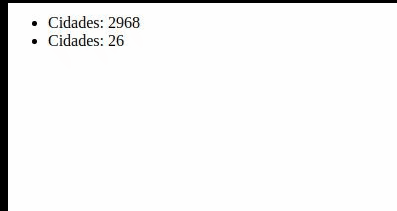

# Accordion

Script que realiza a animação incremental de números.

## Exemplo de Utilização

- Baixe os assets presentes na pasta **./dist**.
- Inclua junto os assets em uma pasta de sua preferência

**Imagem:**



**Código:**

```html
<div class="numeros ativo">
  <ul>
    <li>Cidades: <span data-numero>5570</span></li>
    <li>Estados: <span data-numero>26</span></li>
  </ul>
</div>
<script>
  // código para o arquivo ./dist/anima-numeros.js
  // O primeiro parâmetro(numeros): Seletor para buscar os elementos que contém os numeros
  // O segundo parâmetro(ObserverTarget): Elemento pai que irá englobar os numeros

  // O terceiro parâmetro(ObserverClass): Classe que indica quando a animação deve ocorrer,
  // pois há um observador que verifica a atição de classes no ObserverTarget,
  // permitindo definir quando a animação irá ocorrer, através da adição desta classe no ObserverTarget
  const animaNumeros = new AnimaNumeros('[data-numero]', '.numeros', 'ativo');
  animaNumeros.init();
</script>
```

## Testar Utilização

Para testar a utilização: É possível através do arquivo **./exemplo.html**

Para desenvolver: Utilize o arquivo **./index.html**

## Funcionamento

O **terceiro** parâmetro passado para a classe do **AnimaNumeros** serve para podermos determinar
**quando** a animação deve ocorrer.

Ex: As vezes é necessário animar os números somente quando a **div** que engloba eles estiver visível,
para isso, podemos definir uma classe que se adicionada nessa **div**, **dispara** a animação.
